The purpose of this exercise is to determine whether unsupervised
learning on a set of chemical properties can be used to categorize data
in such a way that it aligns with privileged outcomes omitted from the
data set. These privileged outcomes are the color of wine and the
overall quality. We will also comment on which dimension reduction
technique is best for this task.

First, we will examine how clustering can be used to determine color.

Before visualizing the clusters, we need to narrow down the variables
that we want to compare. Let’s look at correlation between each chemical
property and a given wine color.

    ##                             [,1]
    ## fixed.acidity        -0.48673983
    ## volatile.acidity     -0.65303559
    ## citric.acid           0.18739650
    ## residual.sugar        0.34882101
    ## chlorides            -0.51267825
    ## free.sulfur.dioxide   0.47164366
    ## total.sulfur.dioxide  0.70035716
    ## density              -0.39064532
    ## pH                   -0.32912865
    ## sulphates            -0.48721797
    ## alcohol               0.03296955

Note that here higher positive correlation means that the property is
more closely associated with white wine. We will choose the covariates
with the greatest correlation (positive or negative) with wine color. In
this case, it would be volatile acidity, chlorides, total sulfur
dioxide, and sulphates.

We will compare the selected variables by color and them by cluster.
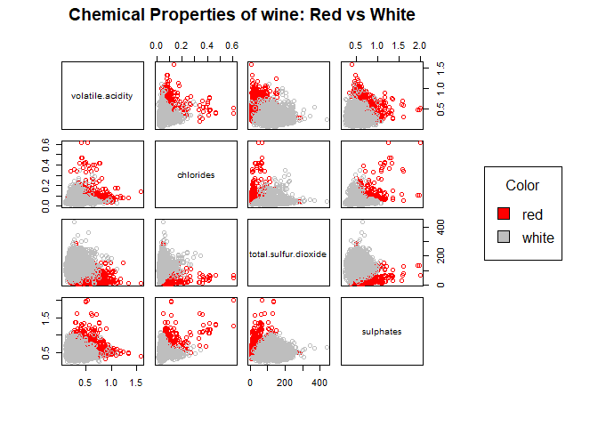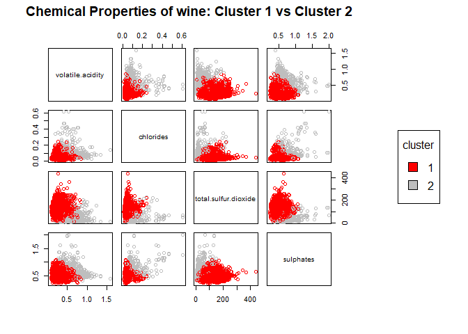

At least on sight, the clustering algorithm seems to separate the red
and white wines effectively.

We assign red wine to cluster 1 and white wine to cluster 2, and show
the confusion matrix.

    ## Confusion Matrix and Statistics
    ## 
    ##           Reference
    ## Prediction  red white
    ##      red     24  4830
    ##      white 1575    68
    ##                                           
    ##                Accuracy : 0.0142          
    ##                  95% CI : (0.0114, 0.0173)
    ##     No Information Rate : 0.7539          
    ##     P-Value [Acc > NIR] : 1               
    ##                                           
    ##                   Kappa : -0.5761         
    ##                                           
    ##  Mcnemar's Test P-Value : <2e-16          
    ##                                           
    ##             Sensitivity : 0.015009        
    ##             Specificity : 0.013883        
    ##          Pos Pred Value : 0.004944        
    ##          Neg Pred Value : 0.041388        
    ##              Prevalence : 0.246114        
    ##          Detection Rate : 0.003694        
    ##    Detection Prevalence : 0.747114        
    ##       Balanced Accuracy : 0.014446        
    ##                                           
    ##        'Positive' Class : red             
    ## 

To be thorough, we will run the null model.

    ## Warning in confusionMatrix.default(data = as.factor(rep("white",
    ## length(clust_k2$cluster))), : Levels are not in the same order for
    ## reference and data. Refactoring data to match.

    ## Confusion Matrix and Statistics
    ## 
    ##           Reference
    ## Prediction  red white
    ##      red      0     0
    ##      white 1599  4898
    ##                                           
    ##                Accuracy : 0.7539          
    ##                  95% CI : (0.7432, 0.7643)
    ##     No Information Rate : 0.7539          
    ##     P-Value [Acc > NIR] : 0.5067          
    ##                                           
    ##                   Kappa : 0               
    ##                                           
    ##  Mcnemar's Test P-Value : <2e-16          
    ##                                           
    ##             Sensitivity : 0.0000          
    ##             Specificity : 1.0000          
    ##          Pos Pred Value :    NaN          
    ##          Neg Pred Value : 0.7539          
    ##              Prevalence : 0.2461          
    ##          Detection Rate : 0.0000          
    ##    Detection Prevalence : 0.0000          
    ##       Balanced Accuracy : 0.5000          
    ##                                           
    ##        'Positive' Class : red             
    ## 

As we see, from the confusion matrix, clustering seems to be a fairly
good method of sorting red and white wines.

However, clustering does not seem to be the most appropriate method for
sorting if we are interested in determining what chemical balance is
associated with a given wine color. Let’s consider this while we look at
another dimension reduction technique, principle components analysis.

PCA allows for mixed membership of covariates to construct principle
components.

    ##        fixed.acidity     volatile.acidity          citric.acid 
    ##          -0.23879890          -0.38075750           0.15238844 
    ##       residual.sugar            chlorides  free.sulfur.dioxide 
    ##           0.34591993          -0.29011259           0.43091401 
    ## total.sulfur.dioxide              density                   pH 
    ##           0.48741806          -0.04493664          -0.21868644 
    ##            sulphates              alcohol 
    ##          -0.29413517          -0.10643712

Now, we want to do some visualization.

    ## Warning: Ignoring unknown parameters: intercept, slope

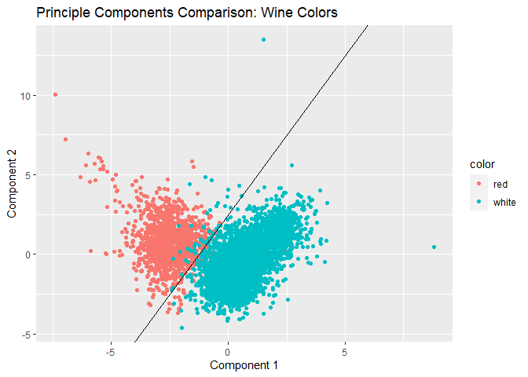

We see that red and white wine split roughly along the line component2 =
component1 - 2.5. We can take this information and see if a point lands
on either side of this line to determine whether the wine is red or
white.

    ## Confusion Matrix and Statistics
    ## 
    ##           Reference
    ## Prediction  red white
    ##      red   1517    49
    ##      white   82  4849
    ##                                           
    ##                Accuracy : 0.9798          
    ##                  95% CI : (0.9761, 0.9831)
    ##     No Information Rate : 0.7539          
    ##     P-Value [Acc > NIR] : < 2.2e-16       
    ##                                           
    ##                   Kappa : 0.9453          
    ##                                           
    ##  Mcnemar's Test P-Value : 0.005176        
    ##                                           
    ##             Sensitivity : 0.9487          
    ##             Specificity : 0.9900          
    ##          Pos Pred Value : 0.9687          
    ##          Neg Pred Value : 0.9834          
    ##              Prevalence : 0.2461          
    ##          Detection Rate : 0.2335          
    ##    Detection Prevalence : 0.2410          
    ##       Balanced Accuracy : 0.9694          
    ##                                           
    ##        'Positive' Class : red             
    ## 

This method is fairly accurate. We could fine tune the line to get a
better prediction, but we are not sure how possible this would by just
looking at unsupervised information. Even the way we constructed line
above required us to peek at that shape of the data.CPA may be
preferable if we are trying gleam something about the chemical
composition of either red or white wine, but if we are just looking at
classification, clustering seems to be the better method.

Now, let’s move on to classifying wine by quality instead of color.

Using k-means ++ and setting k = 10 may work since wines are rated on a
scale of 1 to 10. But, we will let k = 7. We will see whay later as to
why we want to choose 7 over 10.

Let’s cluster the data, find the covariates of greatest interest, and
visualize the clusters.

    ##                             [,1]
    ## fixed.acidity        -0.07674321
    ## volatile.acidity     -0.26569948
    ## citric.acid           0.08553172
    ## residual.sugar       -0.03698048
    ## chlorides            -0.20066550
    ## free.sulfur.dioxide   0.05546306
    ## total.sulfur.dioxide -0.04138545
    ## density              -0.30585791
    ## pH                    0.01950570
    ## sulphates             0.03848545
    ## alcohol               0.44431852

Note, there are not that many chemical properties with a particular
strong correlation with quality.

Like previously, here is a set of pairwise graph of select chemical
properties, fill is by quality score. Note, that while the wines were
score on a scale of 1 to 10, only scores of 3 through 9 were given.

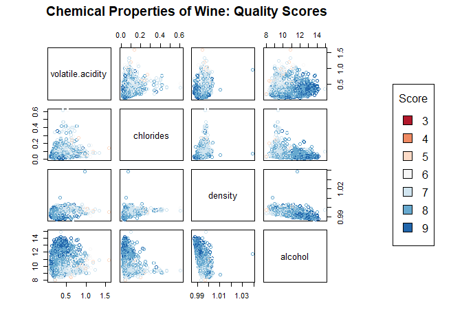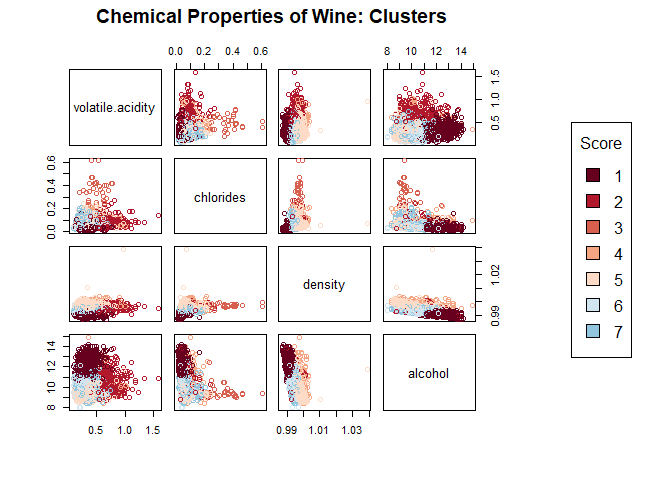

We cannot see any “clean” clusters from the plots. What if we were less
ambitious and only looked at “high quality” and “low”quality" wines?
Here, “high quality” corresponds to scores 7 and higher, while “low
quality” corresponds to scores 6 or lower.

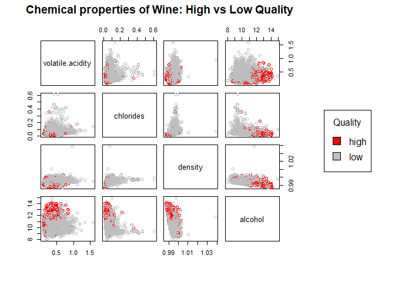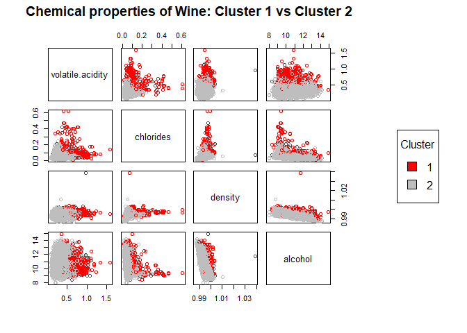

When just considering a binary choice between high and low quality wines
versus k = 10 many clusters, the clustering algorithm preforms better,
but not necessarily well. Let’s run a confusion matrix, just to check.

    ## Confusion Matrix and Statistics
    ## 
    ##           Reference
    ## Prediction high  low
    ##       high 1062 3792
    ##       low   215 1428
    ##                                           
    ##                Accuracy : 0.3833          
    ##                  95% CI : (0.3714, 0.3952)
    ##     No Information Rate : 0.8034          
    ##     P-Value [Acc > NIR] : 1               
    ##                                           
    ##                   Kappa : 0.0511          
    ##                                           
    ##  Mcnemar's Test P-Value : <2e-16          
    ##                                           
    ##             Sensitivity : 0.8316          
    ##             Specificity : 0.2736          
    ##          Pos Pred Value : 0.2188          
    ##          Neg Pred Value : 0.8691          
    ##              Prevalence : 0.1966          
    ##          Detection Rate : 0.1635          
    ##    Detection Prevalence : 0.7471          
    ##       Balanced Accuracy : 0.5526          
    ##                                           
    ##        'Positive' Class : high            
    ## 

Our accuracy is 61%, which is worse than our null model. PCA may be more
appropriate for this classification problem. We’ve already run our PCA
algorithm, so let’s go straight to the plots.

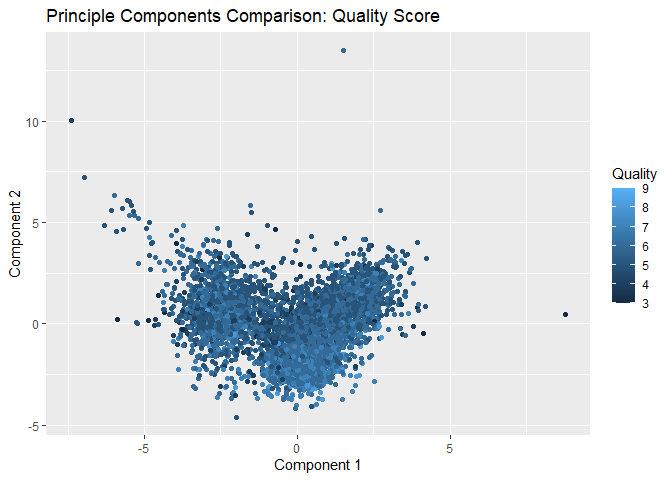 Let’s look
at a few more pairwise comparison.

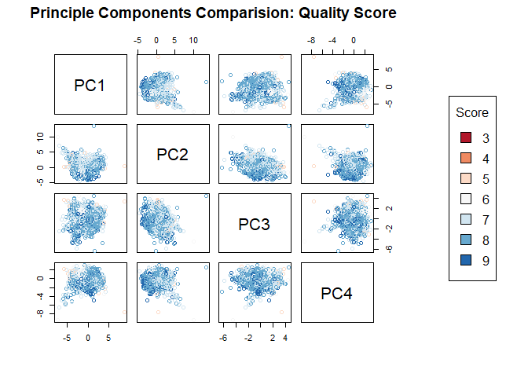

Again, there is no clear delineation what properties correspond to
quality rankings. Again, let’s look at sorting on just “high” and “low”
quality wines.

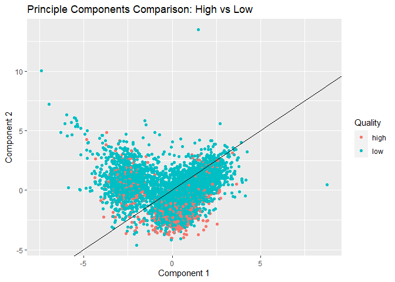

There is not clean divide among the types of wine. To verify, let’s look
at pairwise plots for the first four principle components.

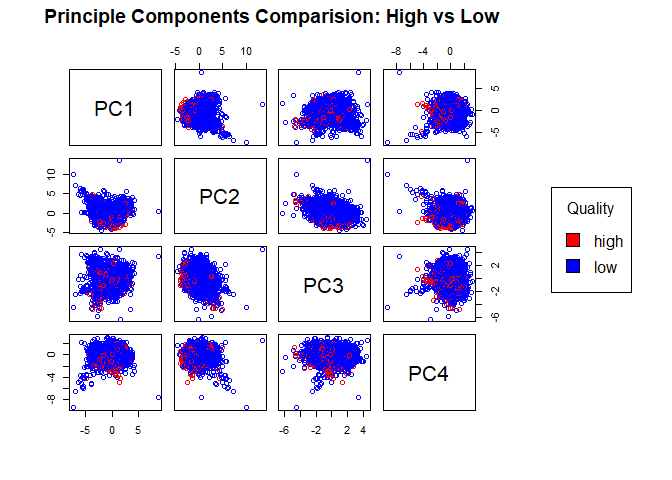

It doesn’t seem that PCA is capable of sorting high vs. low quality
wine.
