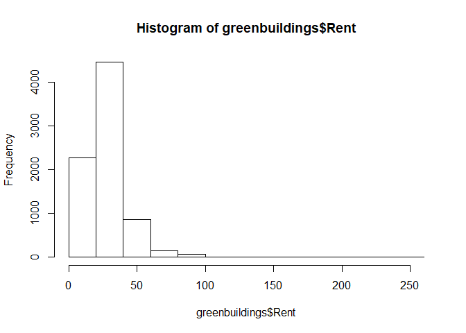
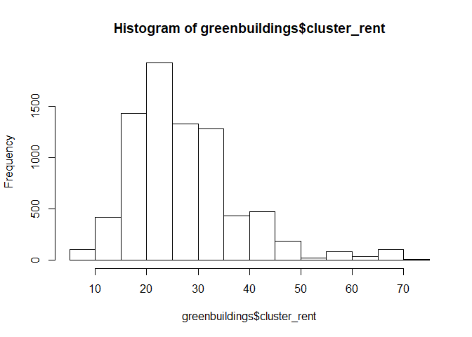
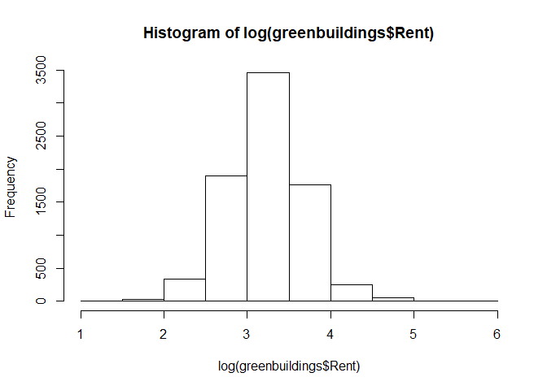
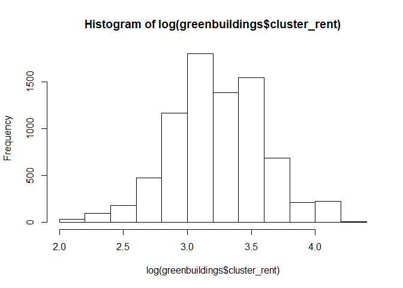
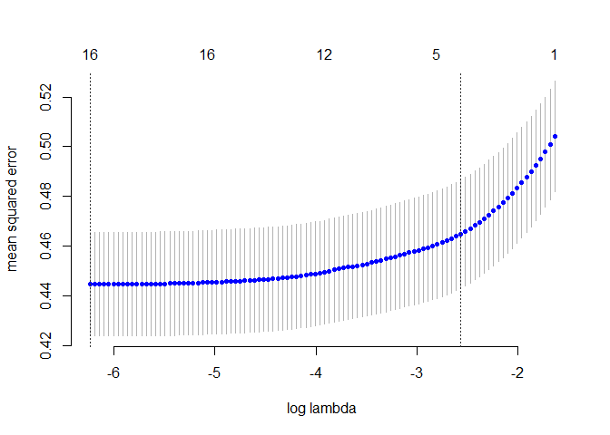

Question 1
================
Name: swatee, simran, david

## Overview

In the green buildings assignment, we are trying to study if green
rating of a building has any effect on the rent it generates. And, if it
does have effect then how much more or less rent does a green rated
building generate compared to a building with similar features which is
not green rated. The features of a building that we are studying along
with green rating are cluster rent, size, employment rate in
neighborhood, occupancy of the building, number of stories, age,
renovated or not, quality of building (class a and class b), rent
charged net of utility, closeness to shopping mall, bank, etc. heating
and cooling in building, rain in the region, gas cost, and electricity
cost. Studying these features will help us control for effects that
these features have on the building rent. Hence, we will be able to
isolate the effect of green rating on a building’s rent.

## Data and Model:

Firstly, we looked at the distribution of rent and cluster rent and
found both data sets to be right skewed. So, we decided to transform
rent and cluster\_rent using log functions. Then, we found that rent and
cluster rent are highly correlated. We found a correlation coefficient
of 0.7594093. This makes sense in real world. For instance, if a
building is posh area where rent is high then most likely it will also
have high rent. Hence, we thought it would be apt to standardize rent
based on cluster\_rent. Thus, we created a variable called y that stores
standardized log rent. Simultaneously, we created a sparse matrix of all
the factor variables except for CS\_PropertyID, LEED, Energystar,
cluster\_rent, cluster. We excluded cluster and cluster\_rent because
they are part of the dependent variable as we have standardized rent
based on cluster rent. Then, we excluded CS\_PropertyID because it is an
identifier of the buildings and has no economic meaning. Finally, we
excluded LEED and Energystar because they are the 2 types of green
ratings that a building receives. Hence, including them would cause
multicollinearity with green rating variable which is included our
sparse matrix. Afterwards, we fit a lasso regression in the data set and
conduct cross validation with 10 folds.

``` r
# import data and examine it
library(gamlr) 
```

    ## Loading required package: Matrix

    ## Warning: package 'Matrix' was built under R version 3.6.3

``` r
greenbuildings <- read.csv("C:/Users/swate/Google Drive/MA Econ/spring 2020 classes/data mining/hw 3/greenbuildings.csv")
View(greenbuildings)
ok <- complete.cases(greenbuildings)
greenbuildings <- greenbuildings[ok,]

# check the correlation between rent and cluster rent
cor(greenbuildings$Rent, greenbuildings$cluster_rent)
```

    ## [1] 0.7594093

``` r
# note that rent and cluster_rent are hugely skewed
# probably want a log transformation here
hist(greenbuildings$Rent)
```

<!-- -->

``` r
summary(greenbuildings$Rent)
```

    ##    Min. 1st Qu.  Median    Mean 3rd Qu.    Max. 
    ##    2.98   19.50   25.20   28.42   34.18  250.00

``` r
hist(greenbuildings$cluster_rent)
```

<!-- -->

``` r
# much nicer :-)
hist(log(greenbuildings$Rent))
```

<!-- -->

``` r
hist(log(greenbuildings$cluster_rent))
```

<!-- -->

``` r
# i create a matrix of all my independent varaibles except for - CS_PropertyID - LEED -Energystar -cluster_rent -cluster  to make it easily readable for gamlr commands.
x = sparse.model.matrix( log(Rent) ~  . - CS_PropertyID - LEED -Energystar -cluster_rent -cluster , data=greenbuildings)[,-1] 

# I create a variable y that normalizes Log(rent) over log(cluster_rent)
y = (log(greenbuildings$Rent)- log(greenbuildings$cluster_rent))/sd(log(greenbuildings$cluster_rent))

# Here I fit my lasso regression to the data and do my cross validation of k=10 n folds
# the cv.gamlr command does both things at once.
cvl = cv.gamlr(x, y, nfold=10, verb=TRUE)
```

    ## fold 1,2,3,4,5,6,7,8,9,10,done.

## Results:

On fitting the lasso regression we see that green rating coefficient is
0. Thus, green rating does not have any effect on the rent of the
building. We also plot lambda values and calculate the lambda value to
see what penalty the lasso regression puts while minimizing the mean
squared error. Lamda is -6.191394 and slopes of 16 variables are used in
the penalty.

``` r
# plot the out-of-sample deviance as a function of log lambda
plot(cvl, bty="n")
```

<!-- -->

``` r
## CV min deviance selection
b.min = coef(cvl, select="min")
log(cvl$lambda.min) # this gives the value of lamda
```

    ## [1] -6.237911

``` r
sum(b.min!=0) # this gives the coefficent not 0
```

    ## [1] 16

``` r
coef(cvl)
```

    ## 18 x 1 sparse Matrix of class "dgCMatrix"
    ##                           seg21
    ## intercept         -9.506189e-02
    ## size               1.548758e-07
    ## empl_gr            .           
    ## leasing_rate       .           
    ## stories            .           
    ## age               -5.810865e-04
    ## renovated          .           
    ## class_a            1.779558e-01
    ## class_b            .           
    ## green_rating       .           
    ## net                .           
    ## amenities          5.878698e-03
    ## cd_total_07        .           
    ## hd_total07         .           
    ## total_dd_07        .           
    ## Precipitation      .           
    ## Gas_Costs          .           
    ## Electricity_Costs  .

## Conclusion:

Therefore, we conclude that while size, age, class\_a, amenities, and
Gas\_costs have significant impact on rent green rating does not effect
rent. In real world, this seems plausible as most people would care
about the size of the space, its quality indicated by age and class\_a,
its locality indicated by amenities, and gas costs when choosing a place
and deciding on the rent rather than if it’s a green rated building or
not.
